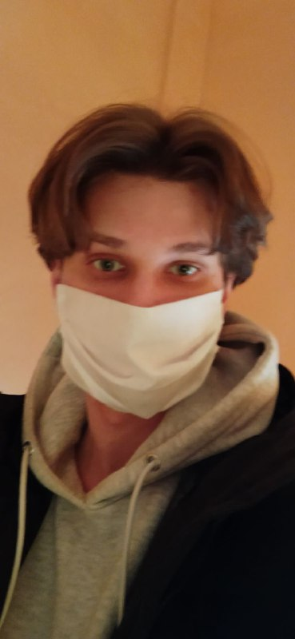

# Kochanov Nikita #

### My Contacts ###
- [Telegram](https://t.me/pieliedie3x)
- [Vk](https://vk.com/pieliedieee)
- Nickname in discord channel KochanovNikita(#kochanovnikita)
- GMail kochanovn207@gmail.com
- Phone number +375291183807
    
***
  
My goal at rs school is to improve old skills and acquire new ones. Of the strengths I have - perseverance, independence, stress resistance, sociability, 
desire to develop.   No work experience, only trained, made some mini projects for myself.
   
***

The programming languages I'm familiar with are C# and JavaScript. Have some knowledge of PHP. 
At the moment I am writing a course project (Bookstore) for an educational institution 
on asp.net core 5 using libraries and technologies of entity framework, bootstrap, js/jquary, ajax. 
The link to the repository with this project will be added later.
  
***
   
From the courses, I took a free front-end course from jetbrains academy,
and also watched video lessons from a private course from some man, 
I found them for free in a telegram, so I don’t know who he is, but I can share them if necessary)
    
***

English at a low level (basic, I can only talk on simple topics). Wrote CV not without the help of Google
